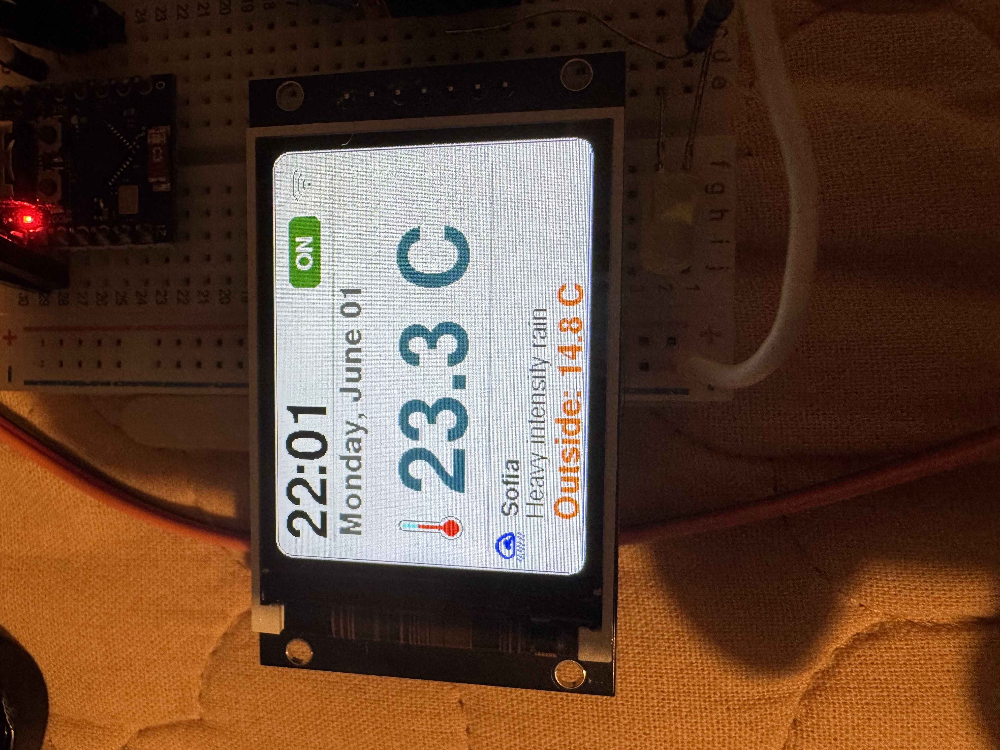

Smart Floor Heating System (ESP32C3 + Blynk IoT) 
An advanced IoT-based floor heating controller built with ESP32C3. This project features a high-end local UI, remote control via Blynk, and a dual-layer safety system combining software logic with professional-grade hardware protection.
🚀 Key Features

    Dual Control Interface: Remote management via the Blynk IoT app and local control via a 2-inch TFT display.
    Rich UI Design: Real-time display of floor temperature, time, date, and local weather data (Sofia) with custom icons.
    Four-State Logic:
        🟢 ON: Heating active (thermostat mode).
        🔴 OFF: Target temperature reached.
        🟠 MAN: Manually disabled via local button.
        ⬜ EMRG: Emergency hardware override active.
    High Safety Standards: Physical power cut-off using an impulse relay, ensuring the system can be disabled regardless of software state.

🛠️ Hardware Components

    Microcontroller: ESP32C3 (RISC-V).
    Display: 2" ST7789 IPS TFT (240x320).
    Temperature Sensor: Waterproof DS18B20.
    Power Control:
        SSR Relay: For silent, logic-based PWM/Thermostat control.
        Impulse Relay (Schneider Easy9 16A): For primary hardware safety.
    Feedback System: 230V AC-DC Optoisolator for hardware status monitoring.
    Heating Element: 160W/m² Warmcoin heating mat.

📐 Wiring & Infrastructure
To ensure a clean and safe installation in a wet environment (toilet/laundry room), the system uses a split-box topology:

    Console (Hallway): Houses the ESP32C3, display, and buttons.
    Power Box (Inside room): Houses the SSR, Impulse relay, and Optoisolator.
    Connectivity: A single LAN (Cat5/6) cable connects the two boxes, carrying 3.3V/5V signals (VCC, GND, SSR Control, Feedback), while 230V lines are kept separate for safety.

💻 Software Architecture
The firmware is developed in C++ using the Arduino framework.

    Blynk IoT: Handles cloud communication and mobile app synchronization.
    Graphics: Uses Adafruit_GFX and GFXcanvas16 for flicker-free screen updates.
    Safety Logic: An interrupt-based system monitors the AC Optoisolator. If the hardware button is pressed, the impulse relay cuts the 230V line to the SSR, and the ESP32 immediately updates the UI to EMRG/MANUAL OFF.

📸 Interface Preview
 The display shows the current floor temperature, status (ON), and outdoor weather conditions.
⚠️ Safety Warning
This project involves 230V AC wiring. All high-voltage components must be housed in an IP65-rated enclosure. Always ensure the circuit is de-energized before making any modifications.

--------------------------------------------------------------------------------
How to use

    Clone this repository.
    Replace BLYNK_AUTH_TOKEN, ssid, and pass in the code with your credentials.
    Install required libraries: Blynk, Adafruit_GFX, Adafruit_ST7789.
    Flash the code to your ESP32C3.

